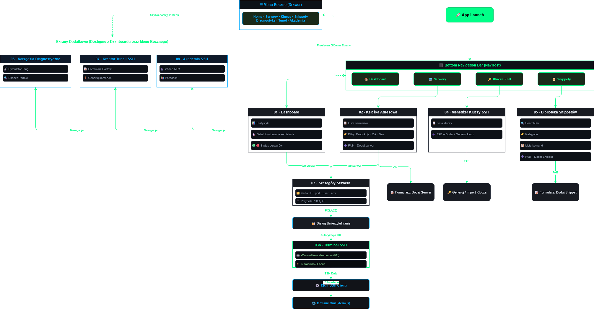
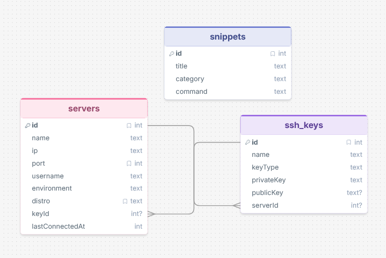

# EasySSH — Mobilny przybornik administratora systemów (SysAdmin / DevOps)

EasySSH to natywna aplikacja na system Android przeznaczona dla administratorów systemów i inżynierów
DevOps. Pełni rolę kieszonkowego przybornika, który w jednym miejscu pozwala bezpiecznie przechowywać
konfiguracje dostępowe do serwerów (adresy IP, porty, użytkownicy, środowiska), zarządzać kluczami
kryptograficznymi SSH, gromadzić często używane komendy oraz nawiązywać realne połączenia SSH wprost
z telefonu. Aplikacja zawiera dodatkowo moduł diagnostyki sieci, kreator tuneli SSH oraz edukacyjną
bazę wiedzy z zakresu cyberbezpieczeństwa.

Całość utrzymana jest w spójnej, ciemnej, „terminalowej" estetyce (akcent `#00FF88`, czcionka
monospace), a interfejs zbudowano w pełni deklaratywnie w Jetpack Compose.

## Kluczowe Funkcje

- **Książka adresowa serwerów** — lista zapisanych maszyn wczytywana z bazy w czasie rzeczywistym
  (`LazyColumn` + `Flow`), z wyszukiwarką, filtrowaniem po środowiskach (Produkcja / QA / Dev),
  grupowaniem oraz ikonami dystrybucji Linuksa (Ubuntu, Debian, CentOS, Fedora, Rocky). Dodawanie,
  edycja i usuwanie serwerów odbywa się przez formularz (`AddServerSheet`).
- **Menedżer kluczy SSH** — generowanie kluczy w trzech algorytmach (Ed25519, RSA 4096, ECDSA 256),
  import kluczy z pliku, ochrona hasłem (passphrase), przypisywanie klucza do serwera oraz instalacja
  klucza publicznego na zdalnej maszynie (odpowiednik `ssh-copy-id`).
- **Biblioteka skryptów (snippety)** — katalog gotowych komend bashowych z podziałem na kategorie,
  wyszukiwaniem, edycją i kopiowaniem do schowka jednym dotknięciem.
- **Terminal SSH** — realne logowanie po SSH (biblioteka JSch) z czarnym oknem terminala renderowanym
  przez xterm.js w `WebView`. Obsługa uwierzytelniania hasłem, kluczem oraz kluczem chronionym
  passphrase; szybkie komendy i wysyłanie zapisanych snippetów wprost do sesji.
- **Narzędzia diagnostyczne** — ping (ICMP z automatycznym fallbackiem na TCP) oraz skaner portów dla
  wskazanego hosta, z animowanym wskaźnikiem aktywności (radar).
- **Kreator tuneli SSH** — formularz przekierowania portów w trybie lokalnym (`-L`) i zdalnym (`-R`),
  który dynamicznie generuje gotową do skopiowania komendę.
- **Akademia SSH** — ekran edukacyjny z poradnikami (RSA vs Ed25519, tunelowanie portów, hardening SSH),
  schematami sieciowymi oraz materiałem wideo.

## Technologia

- **Język:** Kotlin
- **Interfejs:** Jetpack Compose + Material Design 3
- **Nawigacja:** Navigation Compose (`NavHost`, sealed class `Screen`)
- **Baza danych:** Room (SQLite), wersja schematu 8
- **Asynchroniczność:** Kotlin Coroutines + `StateFlow`
- **Klient SSH:** JSch 0.2.17 (fork mwiede)
- **Kryptografia:** Bouncy Castle 1.78.1 oraz `net.i2p.crypto:eddsa` 0.3.0 (Ed25519 na Androidzie)
- **Terminal:** xterm.js renderowany w `WebView`
- **Parametry kompilacji:** `minSdk` 24, `targetSdk` 35, `compileSdk` 35, JDK 11

## Narzędzia i Zasoby Zewnętrzne

Biblioteki i komponenty firm trzecich oraz pochodzenie zasobów multimedialnych:

| Element | Źródło / narzędzie | Zastosowanie |
|---|---|---|
| **JSch** (fork mwiede 0.2.17) | [github.com/mwiede/jsch](https://github.com/mwiede/jsch) | klient SSH, kanał `shell`, generowanie RSA/ECDSA |
| **Bouncy Castle** 1.78.1 | [bouncycastle.org](https://www.bouncycastle.org/) | parsowanie kluczy, generowanie Ed25519 |
| **net.i2p.crypto:eddsa** 0.3.0 | [github.com/str4d/ed25519-java](https://github.com/str4d/ed25519-java) | podpisy Ed25519 podczas łączenia na Androidzie |
| **xterm.js** | [xtermjs.org](https://xtermjs.org/) | front-end terminala w `WebView` (`assets/`) |
| **Jetpack Compose / Room / Navigation** | Android Jetpack (Google) | UI, baza danych, nawigacja |
| Diagramy (`docs/images/*.png`) | [draw.io / diagrams.net](https://www.drawio.com/) | schemat aplikacji i bazy danych |
| Ikony dystrybucji Linuksa (PNG) | znaki towarowe odpowiednich projektów (Ubuntu, Debian, CentOS, Fedora, Rocky) | rozpoznawanie systemu serwera |
| Efekty dźwiękowe (`res/raw/*.mp3`) | darmowa biblioteka [Pixabay](https://pixabay.com/sound-effects/) (autorzy: *SoundShelfStudio*, *Universfield*) | dźwięk sukcesu / błędu |
| Materiał wideo (`res/raw/ed25519_tutorial.mp4`) | [Wideo open source z YouTube](https://www.youtube.com/watch?v=3PHfKFhvldc) | sekcja „Akademia" |

## Projekt Ekranów



Aplikacja wykorzystuje pojedynczy `NavHost` zadeklarowany w `MainActivity`. Nawigacja opiera się na
trwałym dolnym pasku (Bottom Navigation) dla głównych zakładek oraz bocznym menu (drawer) dla narzędzi.

Zakładki dolnego paska:

- **Dashboard** — ekran startowy ze statystykami bazy (liczba serwerów, kluczy, snippetów) oraz sekcją
  „Ostatnio używane", sortowaną po znaczniku ostatniego połączenia (`lastConnectedAt`).
- **Serwery (Książka Adresowa)** — główny widok listy serwerów z filtrami środowisk i wyszukiwarką.
- **Klucze** — menedżer kluczy SSH (lista + Floating Action Button + formularz generowania/importu).
- **Snippety** — biblioteka skryptów z filtrem kategorii i wyszukiwarką.

Ekrany szczegółowe / narzędzia (dostępne z zakładek lub menu):

- **Szczegóły Serwera i Terminal** — detale maszyny oraz przycisk „Połącz", po którym otwiera się okno
  terminala SSH.
- **Diagnostyka** — narzędzia sieciowe (ping, skaner portów).
- **Tunel** — kreator tuneli SSH.
- **Akademia** — baza wiedzy.

## Widok Bazy Danych

Trwałość danych zapewnia biblioteka Room. Baza (`AppDatabase`) składa się z trzech encji, a dostęp do
nich odbywa się przez obiekty DAO opakowane w repozytoria zwracające `Flow`. Pełny opis kolumn znajduje
się w pliku [`modelBazyDanych.md`](modelBazyDanych.md).



### Encja `Server`

Przechowuje konfiguracje maszyn (np. ProdWeb-01, 192.168.1.10).

- `id` — klucz główny
- `name`, `ip`, `port`, `username` — dane dostępowe
- `environment` — środowisko (PROD / QA / DEV) — wykorzystywane do filtrów i etykiet
- `distro` — dystrybucja systemu (ubuntu / debian / centos / fedora / rocky / linux) — wybór ikony
- `keyId` — referencja do domyślnego klucza serwera
- `lastConnectedAt` — znacznik ostatniego użycia (sekcja „Ostatnio używane")

### Encja `SshKey`

Przechowuje wygenerowane lub zaimportowane klucze kryptograficzne.

- `id` — klucz główny
- `name` — nazwa klucza
- `keyType` — typ algorytmu (Ed25519 / RSA / ECDSA / OpenSSH / Imported)
- `privateKey` — klucz prywatny (przechowywany w postaci zaszyfrowanej, patrz Bezpieczeństwo)
- `publicKey` — klucz publiczny w formacie `authorized_keys`
- `serverId` — referencja do serwera, do którego klucz jest przypisany (`null` = klucz ogólny)

### Encja `Snippet`

Przechowuje zapisane komendy (np. „Restart Nginx").

- `id` — klucz główny
- `title` — tytuł komendy
- `category` — kategoria (System / Docker / Sieć / …)
- `command` — treść komendy bashowej

### Relacja dwukierunkowa

Model zakłada dwukierunkowe powiązanie klucza z serwerem: `SshKey.serverId` wskazuje serwer, do którego
klucz należy, a `Server.keyId` wskazuje domyślny klucz serwera. Operacje przypisywania i usuwania kluczy
utrzymują spójność obu stron tej relacji.

## Szczegóły Techniczne

### Warstwa SSH

Sercem aplikacji jest klasa `SshSessionManager` żyjąca na poziomie aplikacji (`EasySshApplication`).
Utrzymuje ona mapę aktywnych sesji (`SshSession`) — po jednej na serwer — dzięki czemu połączenia
**przeżywają nawigację między ekranami oraz niszczenie ViewModeli**. Każda `SshSession` posiada własny
`CoroutineScope` (`Dispatchers.IO`), zarządza cyklem życia połączenia (łączenie, kanał `shell`,
rozłączanie) i wystawia dwa strumienie:

- `state: StateFlow<ConnectionState>` — stan połączenia (`Disconnected` / `Connecting` / `Connected` /
  `Error`),
- `output: SharedFlow<String>` — strumień danych wyjściowych terminala.

Bufor `scrollback` pozwala odtworzyć dotychczasową zawartość terminala po powrocie na ekran. Uwierzytelnianie
obsługuje trzy ścieżki: hasło, klucz oraz klucz chroniony passphrase.

### Terminal

Okno terminala renderowane jest przez xterm.js wewnątrz `WebView` (zasób `assets/terminal.html`).
Komunikacja Kotlin ↔ JavaScript odbywa się przez mostek (`addJavascriptInterface`): wejście użytkownika
trafia z xterm.js do `SshSession.sendData`, a dane z kanału SSH są wstrzykiwane do terminala funkcją
`writeToTerminal`. Z poziomu terminala można też wysyłać szybkie komendy oraz zapisane snippety.

### Generowanie kluczy

- **Ed25519** generowany jest bezpośrednio przez Bouncy Castle (`Ed25519KeyGen`), z pominięciem
  wbudowanego w Android dostawcy JCE/EdDSA, który na części urządzeń jest niekompletny i zgłasza
  `UnsupportedOperationException`. Klucz zapisywany jest w formacie OpenSSH.
- **RSA 4096** i **ECDSA 256** generowane są przez JSch.
- Biblioteka `net.i2p.crypto:eddsa` zapewnia obsługę podpisów Ed25519 podczas łączenia na Androidzie.

### Bezpieczeństwo

- **Szyfrowanie w spoczynku** — klucze prywatne nie są przechowywane jawnie. Obiekt `CryptoManager`
  szyfruje je algorytmem AES-256-GCM z kluczem trzymanym sprzętowo w **Android Keystore**; materiał
  klucza nigdy nie opuszcza Keystore.
- **Ochrona hasłem (passphrase)** — opcjonalne hasło klucza realizuje warstwa `KeyVault`
  (PBKDF2 → AES-256-GCM), jednolicie dla wszystkich algorytmów. Przy łączeniu poprawność hasła jest
  walidowana od razu i w razie błędu zgłaszana czytelnym komunikatem.
- **Wyłączony backup** — `android:allowBackup="false"` zapobiega eksfiltracji bazy przez kopię zapasową.

### Diagnostyka i tunele

- Ping wykonywany jest jako proces ICMP (`/system/bin/ping`), a w razie blokady automatycznie przełącza
  się na sprawdzenie dostępności po TCP (porty 80/443/22/53).
- Skaner portów równolegle sprawdza zdefiniowany zbiór portów (`async`/`awaitAll`).
- Kreator tuneli dynamicznie buduje komendę `ssh -L`/`ssh -R` na podstawie pól formularza.

## Architektura

Projekt realizuje wzorzec **MVVM + Clean Architecture** w pojedynczym module Gradle (`:app`).

### Warstwa danych (`com.example.easyssh.data`)

Encje Room, obiekty DAO oraz repozytoria. Repozytorium izoluje ViewModel od źródła danych — ViewModel
nie komunikuje się bezpośrednio z bazą, lecz przez repozytorium, które wystawia `Flow`.

### Warstwa interfejsu (`com.example.easyssh.ui`)

Ekrany to funkcje `@Composable`, a ich stan pochodzi z ViewModeli przez `collectAsState()`. ViewModel
pełni rolę jedynego źródła prawdy dla widoku: ekspozycja danych następuje przez `StateFlow`
(z użyciem `stateIn`), a modyfikacje przez metody uruchamiane w `viewModelScope`.

Główne ViewModel-e (osobne pliki w pakiecie `ui.viewmodel`): `ServerViewModel`, `SshKeyViewModel`,
`SnippetViewModel` oraz `TerminalViewModel`. Dodatkowo ekran diagnostyki posiada własny
`DiagnosticsViewModel` zagnieżdżony w pliku ekranu. Szczegóły poniżej.

### Strumienie danych i sesje

Listy (serwery, klucze, snippety) płyną z bazy jako `Flow` i są przekształcane w `StateFlow` na potrzeby
Compose. Sesje SSH są celowo wyniesione ponad cykl życia ViewModeli — żyją w `SshSessionManager`
tworzonym raz w `EasySshApplication`.

## Warstwa ViewModeli (szczegółowo)

Każdy ViewModel jest **jedynym źródłem prawdy** dla obsługiwanego ekranu i izoluje Compose od warstwy
danych. ViewModel-e operujące na bazie dziedziczą po `AndroidViewModel`, by przez `Application` sięgnąć
do `EasySshApplication.database` oraz `sshSessionManager`. Wspólny wzorzec ekspozycji list to:

```kotlin
val items: StateFlow<List<T>> = repo.getAll()
    .stateIn(viewModelScope, SharingStarted.WhileSubscribed(5_000), emptyList())
```

`WhileSubscribed(5_000)` utrzymuje strumień przez 5 s po zniknięciu ostatniego obserwatora (przeżywa
obroty ekranu i krótką nawigację), a wszystkie mutacje uruchamiane są w `viewModelScope.launch { … }`.

### Główne ViewModele (osobne pliki — pakiet `com.example.easyssh.ui.viewmodel`)

#### `ServerViewModel`

Najprostszy z ViewModeli danych. Tworzy `ServerRepository` na bazie `serverDao()` i wystawia
`servers: StateFlow<List<Server>>` (pełna lista z `getAllServers()`). Udostępnia `addServer(server)`
oraz `deleteServer(server)`. Logika wyszukiwania, filtrowania po środowiskach i grupowania realizowana
jest **po stronie Compose** — ViewModel celowo dostarcza surową, kompletną listę.

#### `SshKeyViewModel`

Najbardziej rozbudowany funkcjonalnie. Przechowuje `keyDao`, `serverDao` oraz `SshKeyRepository`, a klucze
wystawia jako `keys: StateFlow<List<SshKey>>`. Odpowiada za **szyfrowanie i spójność relacji dwukierunkowej**:

- `addKey(key)` — szyfruje `privateKey` przez `CryptoManager.encrypt(...)` (Android Keystore) **przed**
  zapisem; po wstawieniu, jeśli `key.serverId != null`, ustawia ten klucz jako domyślny serwera
  (`serverDao.setDefaultKey(serverId, newId)`).
- `deleteKey(key)` — najpierw `clearDefaultKeyEverywhere(key.id)` zrywa wszelkie back-referencje
  z serwerów, potem usuwa klucz (brak „wiszących" wskazań).
- `assignKeyToServer(key, newServerId)` — utrzymuje **obie strony** relacji: `setKeyServer`
  (klucz → serwer), `clearDefaultKeyEverywhere` (usunięcie wcześniejszych powiązań), a dla niepustego
  serwera `setDefaultKey` (serwer → klucz). `null` czyni klucz ogólnym.

#### `SnippetViewModel`

Analogiczny do `ServerViewModel`: `SnippetRepository`, `snippets: StateFlow<List<Snippet>>`, oraz
`addSnippet` / `deleteSnippet`. Filtrowanie po kategorii odbywa się w UI.

#### `TerminalViewModel`

Celowo **cienka warstwa** nad `SshSessionManager` — nie przechowuje stanu połączenia ani bufora terminala
(te żyją w `SshSession` na poziomie aplikacji, więc przeżywają zniszczenie ViewModelu).

- `sessionFor(serverId)` → `manager.getOrCreate(serverId)` (jedna sesja na serwer).
- `connect(server, password, selectedKeyId, keyPassphrase)` — w `Dispatchers.IO`: **odszyfrowuje** klucz
  prywatny (`CryptoManager.decrypt`) dopiero w momencie użycia, zapisuje znacznik `setLastConnected(...)`
  (sekcja „Ostatnio używane") i deleguje do `SshSession.connect(...)`.
- **Brak** rozłączania w `onCleared()` — sesje mają przetrwać opuszczenie ekranu terminala.

### Pozostałe ViewModele (bez osobnych plików)

#### `DiagnosticsViewModel` (zagnieżdżony w `DiagnosticsScreen.kt`)

W odróżnieniu od pozostałych dziedziczy po zwykłym `ViewModel()` — nie potrzebuje `Application`, bo
wykonuje wyłącznie operacje sieciowe (nie dotyka bazy). Trzyma stan **w stylu Compose** przez
`mutableStateOf` zamiast `StateFlow`: `targetHost`, `selectedTool` (`enum DiagTool { PING, PORT_SCAN }`),
`isRunning`, `pingOutput: List<String>`, `portResults: List<PortResult>` (`data class
PortResult(port, service, isOpen)` zdefiniowana obok).

- `startTask()` — rozgałęzia na `runPing()` lub `runPortScan()` zależnie od `selectedTool`.
- `runPing()` — uruchamia proces ICMP (`ProcessBuilder("/system/bin/ping", "-c", "4", host)`),
  strumieniuje linie do `pingOutput`; przy `100% packet loss` / `Permission denied` / niezerowym kodzie
  wyjścia stosuje **smart fallback na TCP** (`checkTcpReachability` próbuje portów 80/443/22/53)
  i raportuje wniosek o blokadzie ICMP.
- `runPortScan()` — **równolegle** (`async` + `awaitAll`) sprawdza zdefiniowany zbiór portów
  (FTP, SSH, HTTP, MySQL, RDP, …) z timeoutem na gnieździe.

Jest zagnieżdżony w pliku ekranu, ponieważ jego stan i logika są ściśle związane z jednym widokiem
i nie są nigdzie indziej współdzielone.

> Ekrany **Tunel** i **Akademia** są bezstanowe względem danych (budowa komendy `ssh -L`/`-R`, statyczna
> treść edukacyjna z wideo), a **AddServer**/`AddServerSheet` trzyma jedynie ulotny stan formularza
> w `remember { mutableStateOf(...) }`, przekazując gotowy obiekt `Server` przez callback `onSave` do
> `ServerViewModel.addServer`. Jest to zgodne z zalecanym w Jetpack Compose podziałem na *UI state*
> (ulotny stan widoku utrzymywany w kompozycji) oraz *screen / business state* (utrzymywany
> w ViewModelu). Dzięki temu żadna operacja na danych nie omija warstwy MVVM — pola formularza nie są
> danymi domeny, a ich wynik i tak trafia do bazy wyłącznie przez ViewModel i repozytorium.

## Realizacja Wymagań Multimedialnych

- **Obrazy** — ikony dystrybucji Linuksa (pliki PNG: Ubuntu, Debian, CentOS, Fedora, Rocky), wektorowe
  ikony środowisk (Produkcja, QA, Dev) oraz wektorowe schematy sieciowe w sekcjach „Kreator Tuneli"
  i „Akademia" (tunelowanie portów, kryptografia asymetryczna, handshake SSH).
- **Wideo** — krótki instruktaż „Generowanie klucza Ed25519" w Akademii (`res/raw/ed25519_tutorial.mp4`),
  odtwarzany lokalnie przez `VideoView`.
- **Audio** — dwa pliki dźwiękowe w `res/raw` (`error_attention.mp3`, `success_chime.mp3`) odtwarzane
  przez `SoundPool` (obiekt `SoundFx`): sygnał błędu przy nieudanym połączeniu SSH oraz dźwięk
  potwierdzenia przy kopiowaniu do schowka. W razie, gdyby `SoundPool` nie zdążył jeszcze załadować
  próbki tuż po starcie, stosowany jest awaryjny fallback na sprzętowy `ToneGenerator`.
- **Animacja** — pulsujący radar rysowany na `Canvas` podczas pracy narzędzi diagnostycznych.

Przy pierwszym uruchomieniu `EasySshApplication` wstrzykuje dane przykładowe (seed): zestaw serwerów
z różnymi dystrybucjami i środowiskami oraz zbiór snippetów, dzięki czemu aplikacja od razu prezentuje
pełnię funkcji i multimediów.

## Struktura Projektu

```
app/src/main/
├── assets/                     zasoby xterm.js (terminal.html, xterm.js, xterm.css)
├── java/com/example/easyssh/
│   ├── data/                   encje Room, DAO, repozytoria (Server, SshKey, Snippet)
│   ├── navigation/             definicja tras (sealed class Screen)
│   ├── security/               CryptoManager (Keystore), KeyVault (passphrase)
│   ├── ssh/                    SshSessionManager, SshSession, Ed25519KeyGen, KeyInstaller
│   ├── ui/
│   │   ├── components/         komponenty wspólne (karty, etykiety, badge środowisk)
│   │   ├── screens/            ekrany Compose (Dashboard, Servers, Terminal, Keys, …)
│   │   ├── theme/              kolory, typografia, motyw
│   │   └── viewmodel/          ViewModel-e
│   ├── util/                   SoundFx (efekty dźwiękowe — SoundPool/res/raw)
│   ├── EasySshApplication.kt   inicjalizacja bazy i seed danych
│   └── MainActivity.kt         NavHost + nawigacja
└── res/
    ├── drawable/               ikony dystrybucji, środowisk, schematy sieciowe
    └── raw/                    wideo (ed25519_tutorial.mp4) + audio (.mp3)
```

## Wymagania i Uruchomienie

Wymagania: Android Studio z JDK 11, Android SDK (`compileSdk` 35), urządzenie lub emulator z Androidem
w wersji co najmniej 7.0 (API 24).

Budowanie z wiersza poleceń:

```bash
./gradlew assembleDebug          # zbuduj debugowy APK
./gradlew installDebug           # zbuduj i zainstaluj na podłączonym urządzeniu
./gradlew build                  # pełny build (kompilacja + testy)
```

Funkcje wymagające realnego połączenia (logowanie SSH, instalacja klucza na serwerze) najlepiej testować
na maszynie z dostępnym serwerem SSH (np. lokalny home lab).

## Efekt Końcowy

EasySSH łączy bezpieczne przechowywanie konfiguracji i kluczy z realną funkcjonalnością klienta SSH na
urządzeniu mobilnym. Dzięki konsekwentnej architekturze MVVM + Clean Architecture, trwałym sesjom SSH
na poziomie aplikacji oraz szyfrowaniu kluczy w Android Keystore, aplikacja jest jednocześnie czytelna
w kodzie i praktyczna w codziennej pracy administratora.
